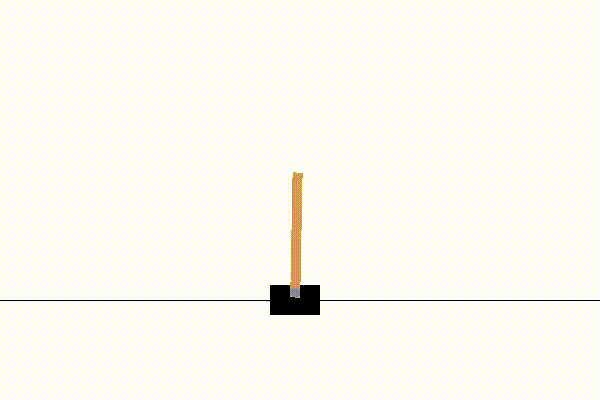
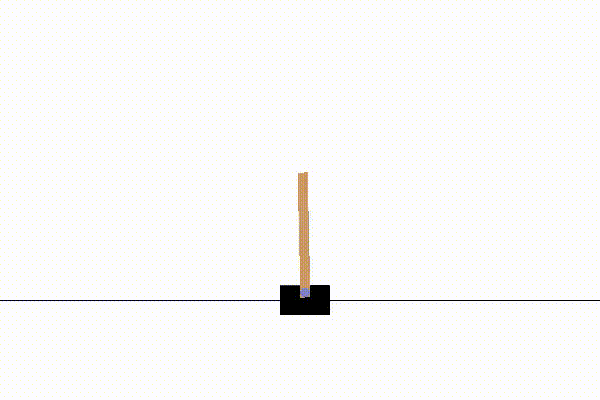

# 01 Gym CartPole

---

Based on [OpenAI Gym CartPole](https://gym.openai.com/envs/CartPole-v1/) environment.

## Methods

### *RL*(Reinforced Learning) Neuroevolution

Here we are going to start by attempting to work on one of OpenAI Gym's environment, `CartPole-v1`. This time we will be using a **reinforcement learning** approach.

Deep neural networks which uses genetic algorithm to mutate their weights will be used, i.e. **neuroevolution**. Hence, we will not be messing around with backpropagation to update them, unlike the ordinary neural network we have known. Unlike [NEAT](https://en.wikipedia.org/wiki/Neuroevolution_of_augmenting_topologies), we will not evolve the network topology.

The agent is created from scratch, its simple yet flexible enough that we can easily adjust the neural network layer topology, along with the activation functions on each of them.

### *SL*(Supervised Learning) Deep Neural Network

On this example, we will be using a unique approach to solve the CartPole problem. We would first train our model on the generated dataset observation-action pairs, and see how well the trained model will perform. It is similar to a **supervised learning** method, our model/agent will not be learning based on the reward *on-the-go*.

The model will be a deep neural network, which we will be using Keras with TensorFlow backend. The training dataset will be generated by running random actions on an environment beforehand, and collecting these observation-action pairs which yields a reward above a given treshold; we only want those which reach a reasonably decent reward with the random actions, we will see how the model can improve from it.

## Additional Content

- `01a_gym_cartpole_train.py` : debug the model locally
- `01a_gym_cartpole_test.py` : run saved model locally
